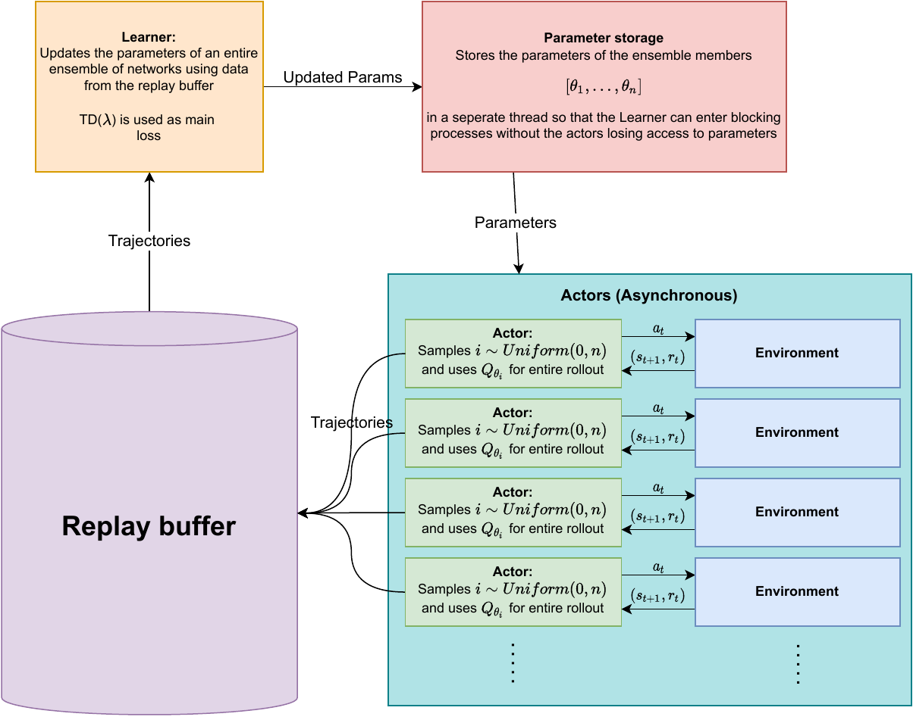

# DeepExplorationEnsembling

A distributed DQN implementation with Thompson sampling using ensembles, incorporating Stein variational Gradient Descent https://arxiv.org/abs/2106.11642 (Francesco D'Angelo, Vincent Fortuin) and Randomized Prior functions https://arxiv.org/abs/1806.03335 (Ian Osband et al.). Written in JAX/Haiku and Ray. Partially based on the IMPALA example in https://github.com/deepmind/dm-haiku.

